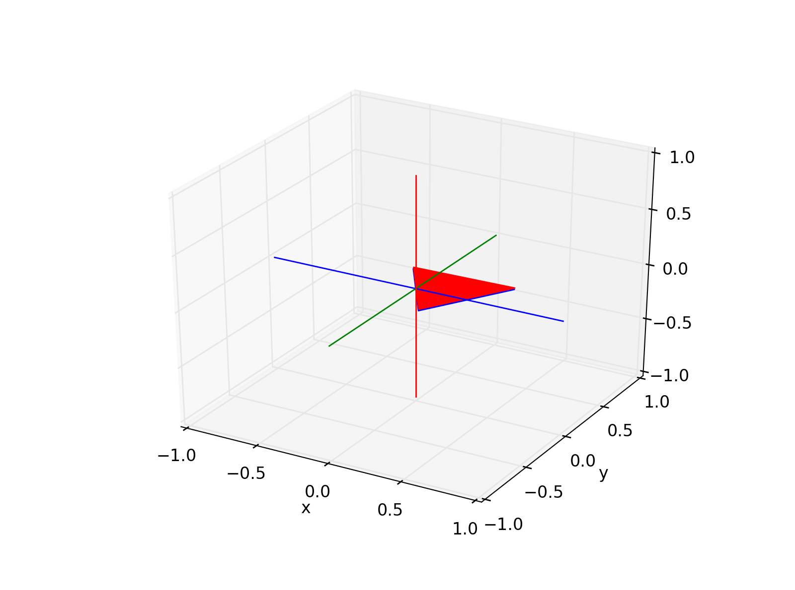

scikit-kinematics - Documentation
=================================

*scikit-kinematics* is a library for scientific data analysis, with a focus on 3d
kinematics.

It is hosted under https://github.com/thomas-haslwanter/scikit-kinematics, and contains the following modules:

*imus*  Analysis routines for IMU-recordings
    - calculation of orientation from velocity, recorded with IMUs or
      space-fixed systems (four different algorithms are implemente here:

      - simple quaternion integration
      - a quaternion Kalman filter
      - Madgwick's algorithm
      - Mahony's algorithm

    - calculation of position and orientation from IMU-signals
    - The sub-directory *sensors* contains utility to import in data from *xio*, *XSens*, and *yei* system

*markers*  Analysis routines for 3D movements from marker-based video recordings
    - a function that takes recordings from video-systems (e.g. Optotrak)
      and calculates position and orientation
    - calculation of joint movements from marker recordings

*quat*  Functions for working with quaternions:
    - quaternion multiplication, inversion, conjugate
    - conversions to rotation matrices, axis angles, vectors
    - a *Quaternion* class, including operator overloading for multiplication
      and division
    - also work on data arrays

*rotmat*  Functions for working with rotation matrices
    - 2D rotation matrices, and 3D for rotations about the x-, y-, and z-axis
    - symbolic rotation matrices
    - conversions to Euler, Fick, Helmholtz angles
    - spatial transformation matrices
    - Denavit-Hartenberg transformations

*vector*  Functions for working with vectors
    - angle between vectors
    - Gram-Schmidt orthogonalization
    - projection
    - normalization
    - rotation
    - also work on data arrays

*simulation* Functions to simulate ideal IMU-signalsG

*view*  Visualization of time-series data, and of 3D orientations.
    **Note:** Since 2021 Mac OSX no longer supports OpenGL. As a consequence,
    the module *view* is no longer automatically loaded, but has to be 
    imported separately, with e.g. *from skinematics import view*!

In addition, the packages includes the general module

*misc*  Mainly GUI-functions for directory- and file selection etc.

.. figure:: _static/viewer_large.png
    :scale: 35%

    Interactively analyze time-series data.

    Visualize 3D orientations.

Installation
------------

The simplest way to install *skinematics* is a two-step process

>>> pip install scikit-kinematics

However, you can also install from the source files. To do this, just go to
the root directory of the package, and type

>>> python setup.py install

**Note**: After *skinematics* is installed, I typically import it in
*Python* with:

>>> import skinematics as skin

Upgrading
---------

For upgrading to the latest version, you have to type

>>> pip install --upgrade --no-deps scikit-kinematics 

**Warning**: Do **not** use *pip install scikit-kinematics -U*, since that
command also upgrades dependencies such as numpy. This can break e.g.
WinPython, since the numpy-version including MKL may be replaced by one
without MKL.

Dependencies
^^^^^^^^^^^^
numpy, scipy, matplotlib, pandas, sympy

Testing
-------

The easiest way to test the package is with *unittest*. Open a terminal,
and type (on the command-line!):

>>> cd [_your_installation_dir_]\skinematics\tests
>>> python -m unittest

Modules
-------

.. toctree::
   :maxdepth: 2

   imus
   misc
   quat
   rotmat
   markers
   vector
   view

Indices and tables
------------------

* :ref:`genindex`
* :ref:`modindex`
* :ref:`search`

.. note::
    | *Author:*     Thomas Haslwanter
    | *Version:*    0.10.4
    | *Date:*       Aug 2025
    | *email:*      thomas.haslwanter@fh-ooe.at
    | *Copyright (c):*      2025, Thomas Haslwanter. All rights reserved.
    | *Licence:*    This work is licensed under the `BSD 2-Clause License <http://opensource.org/licenses/BSD-2-Clause>`_

