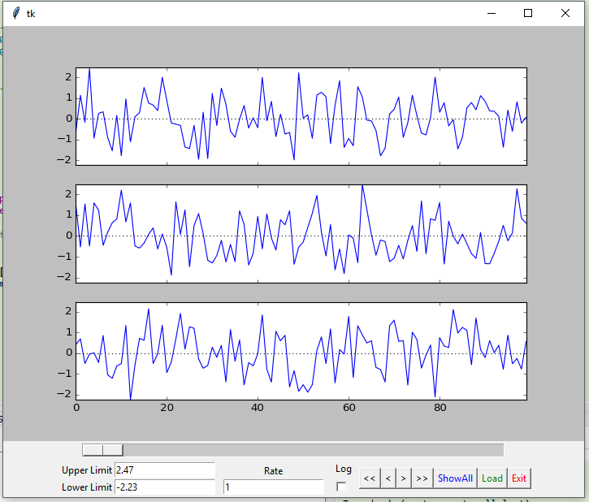

.. _view-label:

Data-Visualization
==================

Visualization of data:
    - ts : Interactive analysis of time-series data (1D and 3D).
    - orientation : Visualization of 3D orientations as animated triangle.

1-dimensional and 3-dimensional data can be viewed. It also allows to inspect the variables of the current workspace.

.. figure:: _static/viewer_large.png
    :scale: 50%

    Interactively analyze time-series data ...

Functions
---------

* :func:`view.ts` ... Viewer for time-series data

    Improved viewability of 3D data.

* :func:`view.orientation` ... Visualize and animate orientations, expressed as quaternions.

.. figure:: _static/orientation_viewer.png
    :scale: 25%

.. toctree::
   :maxdepth: 2

Details
-------
.. automodule:: view
    :members: ts, orientation

