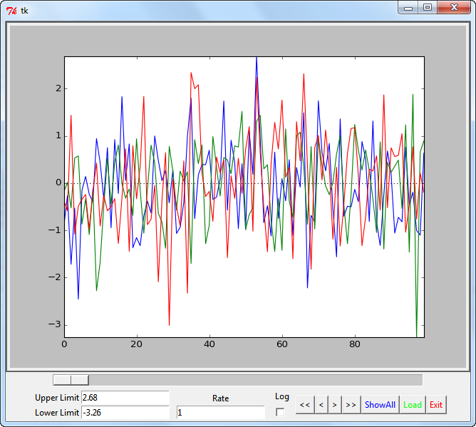
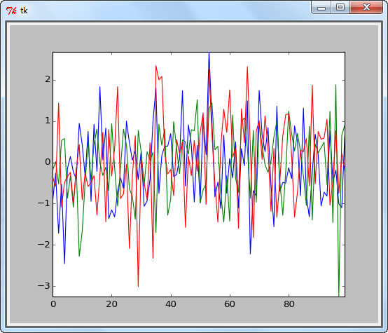

.. _viewer-label:

viewer
======

Interactive analysis of time-series data.

    Interactively analyze time-series data ...

    ... even with small windows sizes.

Functions
---------

* :func:`viewer.ts` ... Viewer for time-series data

.. toctree::
   :maxdepth: 2

Details
-------
.. automodule:: viewer
    :members: ts

